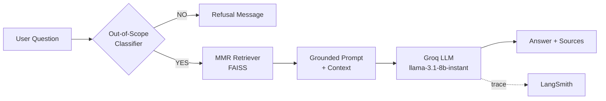

# 🤖 Zyro Dynamics HR Assistant

A retrieval-augmented HR policy chatbot that answers employee questions using **only** the company's actual HR documents — with strict grounding to prevent hallucinated policies, automatic out-of-scope detection, and full request tracing.

**🔗 Live demo:** [hrragmasterclass.streamlit.app](https://hrragmasterclass-ds37dspgrlzbyjh4tvydrg.streamlit.app/)


---

## Why this isn't a generic "PDF chatbot"

Most RAG tutorials stop at "embed documents, retrieve, answer." This one adds two things that actually matter in a real HR deployment:

1. **A scope gate runs before retrieval.** A lightweight classifier call checks whether a question is even HR-related *before* the RAG pipeline runs — so "what's our revenue last year?" or "rank up in Valorant" gets a clean refusal instead of the model improvising an answer from leaked context or general knowledge.
2. **The prompt is built to refuse, not guess.** If the retrieved context doesn't contain the answer, the model is instructed to say so explicitly rather than filling the gap — the single most common failure mode in HR/legal/policy bots.

## How it works



1. **Ingestion:** HR policy PDFs are loaded from `zyro-dynamics-hr-corpus/`, split into 1000-character chunks (200-character overlap), and embedded with `sentence-transformers/all-MiniLM-L6-v2`.
2. **Indexing:** Chunks are stored in a FAISS vector index, cached once per session via `@st.cache_resource`.
3. **Scope check:** Before any retrieval happens, the question is passed to a binary YES/NO classifier prompt that decides if it's actually an HR policy question. Off-topic questions are refused immediately — no LLM call wastes a retrieval pass on them.
4. **Retrieval:** In-scope questions go through **MMR (Maximal Marginal Relevance)** search — not plain top-k similarity — pulling from a wider candidate pool (`fetch_k=30`) and selecting 8 chunks that balance relevance with diversity (`lambda_mult=0.7`), so the answer isn't built from 8 near-duplicate chunks.
5. **Generation:** Retrieved chunks are inserted into a strict grounding prompt that explicitly forbids outside knowledge, inference, and invented details, and mandates a fixed refusal string when the answer isn't in context.
6. **Observability:** Every chain run is traced to LangSmith (`zyro_rag_challenge` project) for debugging and inspection.

## Tech stack

| Layer | Tool |
|---|---|
| Orchestration | LangChain |
| LLM | Groq (`llama-3.1-8b-instant`) |
| Embeddings | HuggingFace `all-MiniLM-L6-v2` |
| Vector store | FAISS |
| Retrieval strategy | MMR (diversity-aware) |
| Tracing | LangSmith |
| UI | Streamlit |

## Running locally

```bash
git clone https://github.com/Shrikar-Dev/HR_RAG_MASTERCLASS.git
cd HR_RAG_MASTERCLASS
pip install -r requirements.txt
```

Create a `.env` file in the project root:

```
GROQ_API_KEY=your_groq_api_key_here
LANGSMITH_API_KEY=your_langsmith_api_key_here
```

Then run:

```bash
streamlit run app.py
```

The app will build the FAISS index from the PDFs in `zyro-dynamics-hr-corpus/` on first load (cached afterward via Streamlit's resource cache).

## Example questions

- What is the work from home policy?
- How does employee onboarding work?
- What expenses can be reimbursed?
- What is the leave approval process?
- What are the remote work security requirements?

Try an off-topic question (e.g. "what's the best Valorant strategy?") to see the scope-gate refusal in action.

## Known limitations

- The out-of-scope classifier and the answer-generation step are two separate LLM calls — this adds latency. A future version could combine them or use a smaller/faster model purely for classification.
- No conversation memory across turns yet — each question is answered independently of chat history.
- Source attribution currently shows file names only, not page numbers.

## Project structure

```
HR_RAG_MASTERCLASS/
├── zyro-dynamics-hr-corpus/   # HR policy PDFs (source documents)
├── app.py                     # Streamlit app + RAG pipeline
├── Starter_Notebook.ipynb     # Original development/exploration notebook
├── requirements.txt
└── .gitignore
```

## License

MIT
